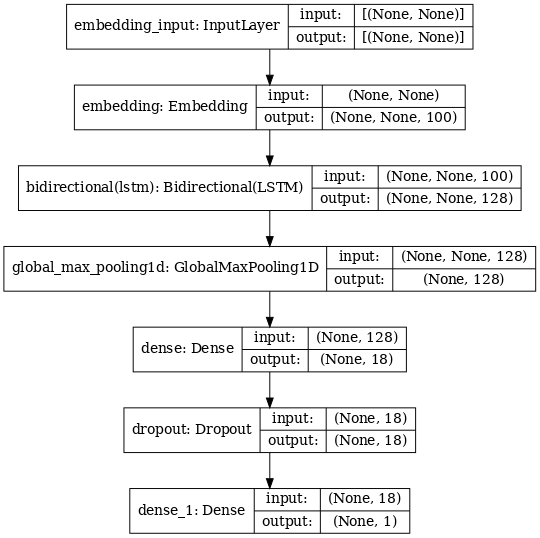

# Open-ended question classifier
Classify between open-ended and close-ended questions, where close-ended questions lead to 'yes/no' answers, and the rest being open-ended questions.

## Downloading data

### Amazon QA dataset
You can download dataset [here](http://jmcauley.ucsd.edu/data/amazon/qa/). Simply download data from available categories and place them in the data/amazon_data

Among those, I downloaded the following categories:
- Appliances 
- Cellphones & Accessories
- Electronics, Office Products 
- Software
- Tools & Home Improvement

These categories seemed to me more generalizable in other domains. Feel free to experiment with other categories!

### Glove embedding vectors
Glove 100d embedding used for model training. Download Glove vectors [here](https://nlp.stanford.edu/data/glove.6B.zip)

## Installing dependencies

Tested on Python 3.7+
```bash
pip install tensorflow==2.3.0 keras-tuner pandas gzip
```

## Usage

### Training
I used KerasTuner to perform hyperparameter search. With current configuration, getting the best parameter took ~ 8 hours on my laptop with Nvidia GTX 2070 MaxQ GPU.
If you want to go through HP search yourself, first run
```bash
python scripts/hp_search.py
```
then to get the final model with best HP

```bash
python scripts/train_model.py
```

However, if you don't want to bother with HP search, change the following in scripts/train_model.py and specify the units to something like this. Training processes won't change.

```python
def model_builder():
    model = Sequential([
        Embedding(len(word_index) + 1, 100, weights=[embedding_matrix], trainable=False),
        Bidirectional(LSTM(64, return_sequences=True, dropout=0.1)),
        GlobalMaxPool1D(),
        Dense(18, activation='relu'),
        Dropout(0.1),
        Dense(1, activation='sigmoid')
    ])
    model.compile(optimizer=Adam(learning_rate=1e-2),
                  loss="binary_crossentropy",
                  metrics=[Precision(), Recall()])
    return model

model = model_builder()
```

### Inference
To simply run the pretrained model in another script
```python
import pickle
from tensorflow.keras.preprocessing.sequence import pad_sequences
from tensorflow.keras.models import load_model

model = load_model('YOUR_PATH_TO_PROJECT/models/amzn_model')
with open('YOUR_PATH_TO_PROJECT/models/amzn_model/tokenizer.pkl', 'rb') as f:
    tokenizer = pickle.load(f)

sample_texts = ['sample text here', 'another text here']
transformed_text = tokenizer.texts_to_sequences(sample_texts)
transformed_text = pad_sequences(sequences=transformed_text, padding='post', truncating='post', maxlen=100)
pred = model.predict(transformed_text)
```

Or simply you can use the provided inference script
```bash
python scripts/sample_inference.py
```

## About Model

This model leverages pre-trained glove embedding, which is connected with Bidirectional LSTM, pooling and some dense layer.

Complex enough to be effective, yet simple enough to not overfit and don't take forever to train! :) 



### Performance
The final model achieves around 94~95% precision, recall, and F-1 score.


## Future Improvements

- Try including all the available categories from the dataset.
- HP search only included changes in unit values, not necessarily regarding inclusion of layers (or, exclusion thereof).
- I'd be curious to know what Transformer models will perform on this dataset, though I suspect only a marginal improvement.

## Contributing
Pull requests welcome!
